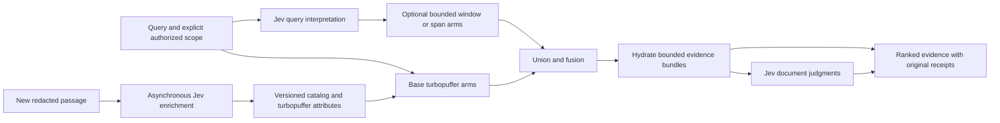

# Recall × Jev: a smaller system that understands its evidence

Implementation plan, approved for execution 2026-09-17. Reviewed against main `d5232b2`.
This supplements the [merged handoff](2026-09-17-recall-jev-judgments-handoff.md)
and H6 in [the Cascade board](../../../.cascade/recall-rewrite.md).
Execution progress and proof live in H6 of the Cascade board. The initial architecture
review made no production change.

The objective is to give Recall one typed semantic boundary and reusable evidence
attributes, then remove the incident-specific interpretation and ranking paths that
boundary supersedes. Success means better evidence near the top, fewer competing
rules, predictable latency, and fewer repeated projection/model calls. A reduction in
regex count alone is not an acceptance criterion.

## 1. What the earlier session established

Central Recall identified Claude session `3429078a-d2cd-4810-923c-d3c66618c59c`,
logical document `ldoc_413af37939e6f2e13ba780304f77d12f`. Its available snapshot spans
September 8–17, ending at `2026-09-17T14:48:00.203084Z`: 17,140 records in ten parts,
all eleven objects including the manifest available. This review inspected the
whole-document inventory, driving prompts, and outcome windows across that span.
It did not export every tool payload or child session. PRs [#610](https://github.com/Parcha-ai/parcha-skills/pull/610)
and [#611](https://github.com/Parcha-ai/parcha-skills/pull/611), merged later that day,
supply the subsequent handoff and wave board.

The causal history matters:

- Availability failed first: ingest exhausted the pool used by readiness and MCP;
  DuckDB also had an architecture mismatch. The systems card made those failures
  measurable instead of conflating them with retrieval quality.
- The latency work exposed a write problem: whole-session reprojection, duplicate
  text copies, index churn, stale statistics, and projection phases starving one
  another. Stable passage identities and differential projection were central fixes.
- Retrieval improved with deeper candidate pools, exact text deduplication, fusion,
  and reranking. Focus windows, composite rerank text, arm range order, date windows,
  and duplicate representatives then produced repeated regressions and reversions.
- Turbopuffer consolidated BM25, ANN, and native embeddings. Migration 067 retired
  the production Postgres search indexes/tables; the embedding worker was suspended.
  That retirement is not a rollback option for the Jev work.
- The remaining proposal was semantic judgments. Scan-plane convergence and a clean
  baseline were still separate unfinished concerns; Jev cannot fix parquet layout.

Opened session outcome receipts include:

- Architecture diagnosis: `recall://claude:linux:greppy3/2daafb2423e0b9f3bc808602-00000000004ef81f?rev=1#item=0`.
- Production retirement: `recall://claude:linux:greppy3/2daafb2423e0b9f3bc808602-0000000002047fbd?rev=1#item=0`.
- TypeSafe exploration: `recall://claude:linux:greppy3/2daafb2423e0b9f3bc808602-00000000020a2cc2?rev=1#item=0`.

The local card history distinguishes the best result from the latest complete run:

| Card timestamp, UTC | Recall@20 | MRR | Server p95 | Interpretation |
|---|---:|---:|---:|---|
| Sep 16, 09:30:07 | 0.875 | 0.5702 | 809.8 ms | Previous best quality result |
| Sep 17, 00:49:13 | 0.875 | 0.5425 | 760.6 ms | After production search-plane retirement |
| Sep 17, 06:15:35 | 0.875 | 0.5350 | 996.4 ms | Latest full run inspected; three gates failed |

The last row had scan agreement 0.9732, one unavailable scan object, and projection
pending 2; later partial reruns remained degraded. These are historical measurements,
not a new live acceptance run. Establish the deployment SHA, evaluator SHA, corpus
snapshot, truth version, and feature settings independently for the next baseline:
several history rows carry the same evaluator checkout SHA across different deployments.

## 2. Correct the boundaries before writing the replacement

The handoff identifies real semantic debt, but its approximately 3,000-line deletion
estimate includes code with other responsibilities. The current retrieval module is
2,986 lines; temporal hints are 639, actor attribution 383, and body thinning 214.
Those file sizes are not semantic-debt counts.

| Area | Jev should own | Code must continue to own |
|---|---|---|
| Query reading | Interpreting date references, requested source families, evidence intent, relevant spans | Calendar arithmetic, valid dates, exact token extraction, explicit filters and scope |
| Document ranking | How well supplied evidence answers the question | Candidate retrieval, coverage, budgets, stable sorting, receipts and fusion math |
| Ingest enrichment | Evidence kind, usefulness for search, contextual annotations | Source preservation, redaction, size limits, archive integrity, backpressure and deletion |
| Same-work grouping | Ambiguous copy/continuation relationships and useful representative | Exact hashes/native lineage, bounded pair selection, preserving every member receipt |
| People | Ambiguous mentions or role suggestions | Verified provider identities, author provenance, tenant boundaries and authorization |

Specific corrections:

1. **Jev does not generate subquestions.** Ask it to select bounded source spans or
   caller-supplied subqueries, with an explicit no-match outcome. Keep the original
   query when candidates do not cover the request. Arbitrary decomposition remains
   with the capable calling agent; do not simulate generation by chaining Choices.
2. **Dates need a typed intermediate form.** Choice answers identify stated components,
   reference type, and granularity. Code resolves offsets, validates ranges, and applies
   timezone rules. Separate interpretation confidence from the existing `exact/loose`
   temporal semantics. Inferred windows stay soft; caller-supplied bounds stay binding.
3. **One source Choice cannot describe several sources.** Use independent Nouls where
   multiple families can apply. The same applies to evidence that contains both a
   decision and a fix. Reserve Choice for mutually exclusive alternatives.
4. **Thinning is not a usefulness classifier.** `thin_canonical_bodies` removes duplicate
   database bodies only after S3 authority and searchable chunks exist. Oversized-record
   digests, record caps, and exact repeat suppression are also integrity/resource rules.
   Preserve them. A low usefulness score may change search projection; it must not erase
   canonical evidence. Never let a secret Noul reverse deterministic redaction or send
   an unredacted suspected credential to a provider for assessment.
5. **Attribution is mostly exact identity work.** `native_actor_references`,
   `is_local_user_authored`, and identity joins read structured provenance. A model may
   annotate ambiguity; it must not replace exact authorship or modify access scope.

These boundaries follow the current code and TypeSafe's documented limitations around
[generation, numerical precision, dates, context size, and adversarial state](https://docs.typesafe.ai/model-jaggedness/jev-1.13.md),
plus its [date extraction pattern](https://docs.typesafe.ai/cookbooks/date_extraction_cookbook.md).

## 3. Architecture and the useful breakthrough

Expose one `recall_server/judgments.py` entry point with a broker transport, versioned
question definitions, typed results, and a small injected client interface. Keep query
policy and ranking weights in the caller. Start with the existing synchronous retrieval
execution model; do not add a second asynchronous architecture or a generic workflow engine.

The adapter consumes the documented HTTP `answers` mapping directly into validated
types. The test double must match the real wire shapes, including Score `legend`,
probabilities, confidence, and Noul's lack of a separate confidence field. Using the SDK
instead is acceptable if its configured broker base URL and retry behavior pass the same
contract tests; callers must not depend on its object shapes.

**Search has an actual dependency graph.** Start the base arms and query interpretation
together. As interpretation becomes available, launch only budgeted supplemental arms.
The handoff's claim that only collapse needs the reading is incorrect for date/clause
retrieval. Approximate critical-path time is
`max(base arms, query reading + supplemental arms) + hydration + document judgment`,
plus any later grouping. Measure that whole path, not just Jev's request duration.
Use one absolute deadline, bounded concurrency, zero hot-path retries, and cancellation
behavior that cannot wait indefinitely for executor shutdown.

**Send evidence bundles, not an arbitrarily leading passage.** Preserve document
identity and a bounded, deterministic selection of strong passages with local context,
roles, and receipt references. Measure this selection separately from the scorer so
the old range-order bug does not become a new input-construction bug. Start with one
answer-quality Score per document; add independent dimensions only when an ablation
shows they help. Query-specific relevance must not be cached as a timeless document fact.

**Fan-out is a stage, not an unlimited HTTP body.** Independent questions share a
request when they fit. Jev currently limits state plus the longest question to 32k
tokens and the whole request to 64k. Fifty 1k-token documents in shared state exceed
the first limit. Compare bounded parallel batches and smaller evidence bundles in W0;
never silently truncate the decisive passage. Score criteria are ordered arrays.

**Ingest judgments become reusable data.** Enrich stable, new or changed passages after
commit, outside the projection transaction. Record tenant/source/passage identity,
input digest including relevant context, resolved model, question-contract hash,
timestamp, status, and raw semantic dimensions. Copy selected dimensions into filterable
turbopuffer attributes and the scan/catalog projection. Missing enrichment is unknown,
not noise. A delayed result must not resurrect a deleted or changed passage.

Use the existing outbox/reconciliation mechanism for idempotent enrichment scheduling.
Do not judge every historical passage again whenever its session grows. Do not couple
rubric-version changes to re-embedding the entire corpus.

This enables decision/fix/plan evidence retrieval, better evidence ordering, and new
views by reweighting existing attributes. A decision filter helps find original decision
records; it does **not** implement H4's recaps, extracted rationale, or supersession
chains. Defer those capabilities until evidence shows they need a separate pipeline.
The caller remains responsible for synthesis and final claims, supported by receipts.

## 4. Execution order, proof, rollback, and deletion

Keep **W0 → W5 → W1 → W2 → W4 → W3 → W6**. W5 packet preparation can overlap W0,
but new labels do not become gold without review. No permanent production shadow
service is needed: frozen replay and bounded activation provide the comparison.

At each phase exit, record four checks beside its ordinary acceptance: **simplicity**
(owners, branches, dependencies added/removed and the next earned deletion), **power**
(which real company question becomes answerable or easier), **breakthrough** (a measured
capability gain beyond rearranging code), and **speed** (end-to-end latency, work and
cost). A phase may pass its tooling checks while still lacking retrieval evidence;
report that distinction explicitly. No unmeasured benefit counts as a pass.

**W0 — transport and feasibility, no production behavior change.**

Own `evals/judgments_spike.py` and representative private fixtures. The key prerequisite
is superseded by broker access. Verify the configured `/typesafe/v1/systemone` route
from each intended runtime, not only an agent sandbox. Pin `jev-1.13.0`, log the resolved
model, and test all three primitives. The installed skill matches upstream byte for byte.

The local consumer on loopback port 9411 now returns valid pinned-model Noul,
Choice, and Score answers after the September 17 21:23 UTC managed lease refresh.
The earlier gateway/allowlist failures are resolved on this machine. This does not
prove access from the separately hosted MCP and worker; Render runtime wiring remains
separate. The measured prototype decision is recorded below.

Measure query reading and 20/50-document scoring shapes, repeated warm/cold requests,
token use, malformed answers, timeout/429/5xx behavior, and date agreement with human
gold. Regex agreement is diagnostic, not ground truth. Record p50/p95, sample counts,
and total request-graph latency. Treat 400 ms query and 500 ms rerank budgets as
hypotheses. Exit: a measured go/no-go per feature and an exact request/response fixture.
Rollback/deletion: discard the experiment; no production path has changed.

**W5 — a verifier capable of detecting improvement.**

Own the offline labeling/review path in `evals/agentic_truth.py` and systems-card
instrumentation, in PRs separate from every candidate implementation. Label proposals
may use Jev; the owner or explicitly delegated reviewer approves them against source
evidence. On September 18 the owner assigned this review to Codex; the ledger records
agent review, not human review or model-probability approval. Add independent
questions from different sessions, people, sources, dates, and failure
types: at least 40 answerable validation questions, with held-out test cases and hard
negatives. Fifty labels on each of the same twelve questions do not create forty cases.

Pool candidates from baseline, proposed retrieval, and known gold outside the retrieved
pool so labeling does not make the existing retriever its own oracle. Preserve the old
15-case set as a historical regression panel. Freeze truth/version/splits; report paired
per-case changes and uncertainty, clustered by related session. Repeated identical
snapshot runs distinguish variability from sampling uncertainty; forty cases do not
guarantee MRR noise below 0.02. Measure Noul calibration before trusting thresholds.
Exit: approved, versioned truth plus repeatability evidence. Rollback: previous truth
version. Delete no strict boundary scorer and never score a candidate solely by its
own Jev judgments.

**W1 — remove semantic query parsing.**

Own `QueryReading` and the input scheduling of `PassageHintRetrieval._search_admitted`.
Begin with source/evidence intent and date components; add span selection only when
candidate coverage is demonstrated. Retain original-query search and exact identifier
candidate extraction. Explicit scope always wins. Confidence is per used field, not one
global number that invalidates unrelated correct answers.

Test calendar boundaries, absent/ambiguous components, multiple sources, identifier
preservation, uncovered clauses, explicit-filter precedence, late answers, and provider
failure before wiring. Retain temporal/canonical retrieval use cases with the feature
off. Gate on no material regression on the frozen expanded set and the old panel;
0.875 recall@20 and 0.57 MRR remain the historical quality targets, not a falsely claimed
current baseline. Jev should serve at least 95% of eligible queries during promotion.
Rollback: query mode off. Earned deletion: semantic temporal/source/clause rules and
their redundant switches after sustained acceptance. Keep date values and arithmetic.
`focus_terms` belongs to W2 and cannot be deleted here while the reranker calls it.

**W2 — replace the sensitive rerank machinery.**

Own `DocumentJudgment`, evidence-bundle construction, and `_rerank_fused`. Replay
Voyage-only, Jev-only over the same eligible pool, and Voyage→Jev as a bounded experiment.
Choose one production path based on quality/latency; do not keep two rerankers merely
because both are available. Report pool recall separately: a scorer cannot recover a
document absent from the pool.

Test evidence selection, contradictory passages, missing fields, ties, partial batches,
token limits, and output order independent of dictionary order. Retain fused ordering
when scoring is unavailable. Exit: improved recall@5 with no recall@20/MRR regression,
stage p95 within the measured budget, and warm search p95 at or below the agreed target.
Add the recall@5 gate in the preceding verifier PR. Rollback: previous rerank mode.
Earned deletion: focus windows, incident-specific range precedence, unused nomination
plumbing, and the superseded provider path after each dependency is proven unnecessary.

**W4 — evidence attributes without recreating projection churn.**

Own passage enrichment, its catalog schema, turbopuffer attributes, and query filter
plumbing. Confirm permission for ingest passage text to go to TypeSafe before activation.
Start with attributes only; activate noise suppression only after audited false-negative
evidence. Allow mixed evidence labels where needed. Choose the next available migration
number at implementation time rather than reserving the handoff's 068 indefinitely.

Test unchanged-passage reuse, context/model/rubric invalidation, idempotent retries,
delete races, unknown/pending attributes, filter round-trips, and rebuild equivalence.
Keep provider calls outside database transactions, pace requests/tokens, and prioritize
fresh canonical evidence over enrichment. Retain thinning, oversized-record integrity,
redaction, forgetting, and actor-isolation e2e tests.

Exit: no retrieval regression, stable freshness, decision/fix strata at least baseline,
fewer noise projections, measured spend, and zero source loss. Rollback: stop enrichment
and ignore attributes; canonical evidence stays intact. Earned deletion: redundant
semantic noise tables and unneeded proposed extraction pipelines. Deterministic storage
safety rules stay.

**W3 and W6 — bounded ambiguity, last.**

W3 owns `group_near_duplicates`: use hashes and explicit lineage first; ask Jev only
about bounded plausible pairs. A source/time prefilter is a candidate heuristic and
must be tested for cross-source copies and continuations outside overlapping windows.
Distinguish semantic similarity from identity. Do not union a contradictory chain
merely because A resembles B and B resembles C. Test copy/continuation/unrelated,
representative selection, contradictory matches, and receipt preservation. Exit:
strict recall at least baseline plus measured grouping errors. Rollback: old grouping
during migration, then no semantic grouping after deletion. Delete the Jaccard threshold
and latest-end-time representative rule only when superseded.

W6 owns suggestions for ambiguous actor mentions. Exact native authorship takes
precedence, candidates are tenant-scoped, and unknown is valid. Store inferred links
separately from authoritative authorship. Exit: employee-attribution e2e unchanged or
better, zero assistant-as-human-author errors, and zero authorization changes. Rollback:
ignore suggestions. Delete only demonstrated name-guessing rules; if there are none
worth replacing, close this wave as unnecessary rather than adding a model call.

**Deletion is an explicit acceptance step for every semantic replacement.** Freeze
retention tests and gates before implementation. After three accepted nightlies with
observed fallback below 1%, sufficient eligible samples, and required operational gates
satisfied, remove the obsolete rules and flags in a separate PR. Count legacy fallback
and intentional abstention separately. Logs carry status/model/contract/timing/tokens,
not text; a single `path=jev` flag must not hide field-level fallback.

Define life after deletion: unavailable query judgments leave base retrieval; unavailable
ranking leaves fused ordering; grouping abstains; ingest remains pending; actor inference
stays unknown. Fault-injection tests prove those paths. Deleting an old implementation
does not justify making Jev an availability dependency for access to original evidence.

## 5. Cost, supporting cleanup, and the first deliverable

The current [published price](https://docs.typesafe.ai/models.md) is $0.042 per million
input tokens. At the handoff's assumptions, 22k input tokens cost $0.000924/search,
and 150k passages × 1.5k tokens cost $9.45/day. These are estimates, not observed bills;
rubrics, batching, actual changed-passage volume, and retries determine the real input.

The supplied routing contract reported $0 passthrough accounting. During execution,
the open [gateway companion PR](https://github.com/Parcha-ai/grep-ops/pull/289)
added a flat $0.000042 per request. Neither is token-exact billing. Record API token
usage and local estimated spend, enforce request/token budgets before dispatch, and
reconcile with TypeSafe's dashboard. Unknown usage after a timeout is not zero spend.
Pin price/model metadata; avoid repeating the earlier unbounded re-embedding bill in
a new enrichment stage.

Two supporting cleanups are justified independently of Jev:

- The shared orchestration currently lives inside the nearly 3k-line Postgres retrieval
  class that turbopuffer subclasses. As replaced paths disappear, extract only the
  remaining orchestration into one backend-neutral owner. Production's migration 067
  does not by itself authorize deleting support used by other repository configurations;
  check callers and retained deployment tests before removing the remaining backend.
- The installed Recall CLI sent unsupported `harness` search filters and `tail` show
  arguments to the hosted MCP during this investigation. Calls using the advertised
  schemas worked. Fix that adapter contract separately; semantic inference will not fix
  an invalid tool argument. Likewise, promote useful ship/card scripts from scratch
  into the repository as a bounded operational follow-up, not a new orchestration layer.

The first implementation deliverable now includes a successful broker contract fixture,
frozen W0 measurements, and a W5 review packet. W0's key/routing blocker is resolved.
The current search prototype does not earn activation or deletion. W5 source review
now has explicit owner delegation to Codex. Twenty-eight reviewed additions are frozen,
growing validation to forty answerable cases plus three existing insufficient cases.
W4 ingest activation still requires the user's data-sharing decision.

### W0 measured decision, September 17

**No-go for activating the current synchronous query/ranking prototype.** Transport
works, but the tested request shapes miss the proposed latency budgets and standalone
Score reordering regresses the frozen strict ranking metrics. This is a decision about
these snippets, rubrics, and request shapes, not a general claim about Jev.

The client remains one inactive standard-library boundary, with no dependencies,
retries, provider fallback, or production retrieval import. The live pilot exposed two
unsupported validation rules: independently rounded probabilities need not sum to
exactly one, and they need not reconstruct the separately returned Score. The client
now preserves those fields as returned, matching the SDK. Exact answer/option coverage,
types, finite bounds, legends, and selected-choice checks remain. Captured-wire
regressions and existing coverage pass 45 focused tests (21 client, 16 rerank, 8 replay).

The private experiment fixes 15 validation queries and 681 returned candidates, then
runs two passes through 234 requests grouped into 90 query/scoring stages. Document
batches use four workers and one shared absolute deadline. All dispatched work is
collected; errors and overruns are not reported as successful completion. There were
231 valid responses and three roughly five-second transport failures, with no response
schema failures after the client correction.

| Request shape | Complete stages | p95 across all attempts | Within proposed budget |
|---|---:|---:|---:|
| 12-question query reading | 29/30 | 3,391 ms | 9/30 at 400 ms |
| 20 documents in two 10-document batches | 30/30 | 2,043 ms | 0/30 at 500 ms |
| Up to 50 documents in up to five batches | 29/30 | 3,578 ms | 0/30 at 500 ms |
| Four source/intent Nouls only | 30/30 | 1,352 ms | 12/30 at 400 ms |
| All 20 document Scores in one request | 30/30 | 876 ms | 0/30 at 500 ms |

The last two shapes are bounded simplification experiments, each 30 requests, run after
the main experiment. Scoring 20 documents in one request cuts requests and improves the
observed tail versus batches, but still misses its target. Samples are small, runs
are sequential experiments rather than a randomized latency comparison, and repeated
passes do not establish provider cache temperature. These are local-broker request
or scoring-stage measurements; retrieval, hydration and the complete production search
graph are not timed here.

The unchanged strict scorer was applied to the main experiment’s frozen final-result
pools (the separate single-request 20-document variant was timed only):

- Existing order: MRR 0.54246, recall@20 0.875, recall@5 0.66667.
- Fully complete second pass at depth 50: MRR 0.22447 and recall@20 0.66667.
- Both complete depth 20 passes preserve recall@20 by construction, but MRR falls to
  0.24083/0.25284 and recall@5 to 0.20833.
- Across the three complete depth/pass comparisons, zero answerable cases improve,
  nine worsen, and three tie. All three insufficient cases remain in the evaluation;
  their false-hit rate remains 1.0. The incomplete first depth 50 pass has one explicit
  whole-case baseline fallback and is never presented as a pure Jev aggregate.

A second independent reconstruction confirmed the candidate mapping and every
aggregate against the original baseline. This is reordering of already-returned
baseline candidates on 256–1025-character excerpts. It is not a full Voyage/Jev
production substitution, full-evidence reader evaluation, or permission to relabel
Jev's preferred documents as gold. Gold outside each frozen pool remains absent.

The main 234-request experiment reports 1,024,693 observed input tokens, about $0.043
at the configured input rate. Three failed calls have unknown usage, so total cost
remains unknown; their reservations are retained. The two simpler shapes add about
$0.0129 observed input cost. These figures are not reconciled provider billing.

Private evidence under `~/.recall/jev-execution-20260917/` includes the exact synthetic
wire response, failed-pilot diagnostics, frozen fixtures and capture hashes,
`stage-run-01-report.json`, `stage-run-01-ranking.json`, its independent crosscheck,
and both variant reports. No source text or private labels are committed.

**Phase check:** simplicity improves in the client (four fewer production lines and
zero dependencies); successful typed answers establish usable plumbing. The current
ranking result fails the power/breakthrough check, and all measured shapes fail their
proposed tail-latency budgets. Keep the existing ranker. W5 source review is now
complete under owner delegation; calibration remains unproven. Date correctness,
Render access, and complete search latency remain
unproven gates before any later activation. No semantic deletion has been earned.

Routing history: final [parcha #8649](https://github.com/Parcha-ai/parcha/pull/8649)
merged as `156b580`, including passthrough authorization. The redundant gateway draft
[grep-ops #290](https://github.com/Parcha-ai/grep-ops/pull/290) was closed in favor of
[#289](https://github.com/Parcha-ai/grep-ops/pull/289), which contains the same ingress
configuration. The old operator receipt is marked obsolete; no cluster rollout was
performed by this agent. Runtime verification and repository merge state are distinct.

Code anchors at the reviewed base:

- `recall/server/recall_server/passage_retrieval.py:116,501,554,764,831,960,2060,2144,2522`
- `recall/server/recall_server/temporal_hints.py:169,583`
- `recall/server/recall_server/turbopuffer_retrieval.py:1,203`
- `recall/server/recall_server/canonical_retrieval.py:1806`
- `recall/server/recall_server/canonical_thinning.py:68`
- `recall/server/recall_server/actor_attribution.py:152,175,215`
- `recall/server/recall_server/passage_index.py:776`
- `recall/evals/agentic_truth.py:572`; `recall/evals/systems_card/accuracy.py:146,237`

Validation entry points for implementation: `python3 -m unittest discover -s tests -v`
from `recall/`, the relevant fresh-Postgres e2e scripts in
`.github/workflows/recall-ci.yml`, offline replay, then the systems card on the deployed
candidate. The original documentation-only planning pass ran no application tests;
subsequent implementation checks and their exact PRs are recorded in H6. Passing
those checks does not establish Jev quality.

### W5 delegated review, September 18

The owner assigned source review and approval to Codex. The review corrected nine
of eighteen retained proposals, excluded ten whose native parent sessions overlap
frozen optimize/test sources, and independently reviewed ten replacements. The
reviewed expansion has 28 additions: 43 validation cases, 40 answerable and three
insufficient. The original 60-case file remains byte-for-byte unchanged. Source
quotes and hashes support each approval; prior Jev probabilities did not approve
or relabel corrected inputs.

The new [verifier PR #615](https://github.com/Parcha-ai/parcha-skills/pull/615) keeps
v2's strict 60-case contract and shares its metric math with an explicit pinned
expansion API. Parent-family overlap with any old case or another addition fails
validation. Full CI passed; the complete old 15-query report is unchanged under the
refactor. The old benchmark itself contains three parent sessions spanning splits;
those historical limitations are preserved and disclosed rather than silently fixed.

The private freeze is
`~/.recall/evals/jev-w5-20260917/delegated-review-20260917/freeze-v1.json`.
The current approval ledger is `review-decisions-v1.jsonl`, with a readable
`review-decisions-v1.html`. [W5 inventory #614](https://github.com/Parcha-ai/parcha-skills/pull/614)
records the source audit, coverage limits, and expanded-baseline measurements.
No candidate code or approved frozen-base content changed in the verifier PR.

Two frozen expanded-baseline passes retained all forty-three cases without backend
errors: recall@20 0.9625 and MRR 0.68423 in both. The original fifteen-case panel
remained at MRR 0.54246; the twenty-eight additions measured 0.74498. The higher
combined value reflects the changed question mix, not a candidate improvement.
Client p95 was 1,859/1,634 ms. The forty positives form thirty-nine parent-session
components; zero observed paired change across two runs does not establish future
stability or calibrated candidate relevance. Full source and measurement receipts
remain in the private freeze directory. Review is complete; a new permission request
for a reviewer is not a prerequisite for continuing measurement.
