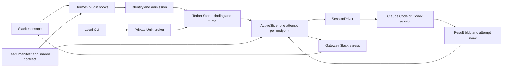

# Tether architecture

This describes the `0.4.0` source runtime. The implementation is authoritative:
[plugin](../runtime/plugin_next/__init__.py),
[orchestration](../runtime/plugin_next/active.py),
[Store](../runtime/plugin_next/store.py), and
[session driver](../runtime/plugin_next/session_driver.py).
The [roadmap](ROADMAP.md) describes the intended AI team workspace separately.

## The current path

The Hermes plugin resolves operator/peer allowlists and Slack identity,
registers available hooks and tools, prepares native context, and wires the
broker and execution loop. Optional host APIs are detected; absence of a host
capability does not make it available through a prompt.

`ActiveSlice` binds a thread to an endpoint, admits messages, coordinates one
turn per endpoint, drives the result, manages presence and sends replies.
It still contains several responsibilities; extraction is driven by the
task/review workflow rather than another general agent framework.

## Identities and state

| Identity | Meaning |
| --- | --- |
| Colleague ID | A configured role/persona in the portable manifest. |
| Endpoint / native session | The exact computer context that owns execution. |
| Binding | Association of an endpoint with a workspace/channel/thread and generation. |
| Attempt | One execution of admitted turns; distinct from a durable task. |
| Delivery | A platform outcome; it does not prove that the user's task is complete. |

The current SQLite Store uses `endpoints`, `bindings`, `turns`, `attempts` and
`thread_origins`. It is not the obsolete schema-17/18 runtime described in older
release documents. `ActiveSlice.status` retains legacy compatibility fields;
those fields are not a supported schema migration API. There is no shipped
`tether schema` orchestrator.

Each thread has its own binding and generation. Endpoints may serve several
threads; the Store serializes attempts sharing an endpoint. Queued turns carry
the binding generation, and rebind/close prevent work from silently moving to
another session. Store startup marks orphaned attempts failed and can import
legacy active bindings from `domain.db`; it does not replay an uncertain
external action as proof that nothing happened.

## Computer execution

Claude Code uses a persistent stream-JSON process per binding, resumed with the
existing session ID. Codex uses an app-server connection and resumes the
existing thread; an explicitly configured exec mode remains available. Herdr
placements use the corresponding interactive session path. The current
transport implementations still need consolidation with compatible Hermes
native adapters; an adapter that starts a fresh session is not an equivalent
replacement for external-session continuation.

Timeout settings describe idle waits. A harness that continues producing
activity may keep working. Cancellation support varies by transport; a failed
or unavailable interruption must not be described as a confirmed stop.

The child environment and launcher are controlled by runtime configuration.
Manifest `computer` values describe colleagues to the model; they do not select
providers, authenticate accounts, change models or replace a bound session.

## Context and delivery

The [team manifest](COLLEAGUES.md) and neutral collaboration contract render
one shared section for Hermes and native prompts. The active prompt adds
source/session identity, incoming turns, attachments and reply guidance.
This is not yet a versioned task context carrying every latest decision,
artifact revision and unresolved finding; that is a next-slice requirement.

Gateway wiring currently uses `SlackEgress` for several direct Slack operations
while host APIs handle other delivery paths. The desired architecture makes
Hermes the platform delivery owner through a supported facade. Until that
consolidation is implemented and verified, do not claim a single delivery
interface or exactly-once Slack effects. A saved result blob, terminal attempt
and platform receipt remain separate facts.

The broker uses protocol 6, bounded newline-delimited JSON, and a same-user
Unix socket. The CLI does not acquire a Slack token. Same-UID processes share
the local authority boundary; the socket is not isolation among those processes.

## Offline development seam

`tether demo` uses actual Store, ActiveSlice and SessionDriver objects with
fake computer and host delivery adapters. It creates and reviews a real
temporary Python artifact, routes a review correction, then asks the original
owner a follow-up. Independent artifact assertions and joined session/attempt
IDs make the receipt inspectable. The fake computer behavior is deterministic;
the episode tests mechanics, not intelligence or actual Slack connectivity.

The demo never discovers Herdr, starts a native computer or calls a model.
Temporary state is removed after the receipt is assembled. Contributors can
extend the episode and regression tests without our fleet or credentials.

## Next architectural boundary

Stable Hermes task references will connect owners, dependencies, artifact
revisions and review findings across attempts. Tether will prepare context and
associate conversation with execution; Hermes task services will remain the
task authority. Jev can then provide optional contextual judgments over that
evidence, while identity, permissions and cancellation stay deterministic.
Grep requires a concrete adapter against its actual execution API. These are
roadmap deliverables, not capabilities added by this first slice.
