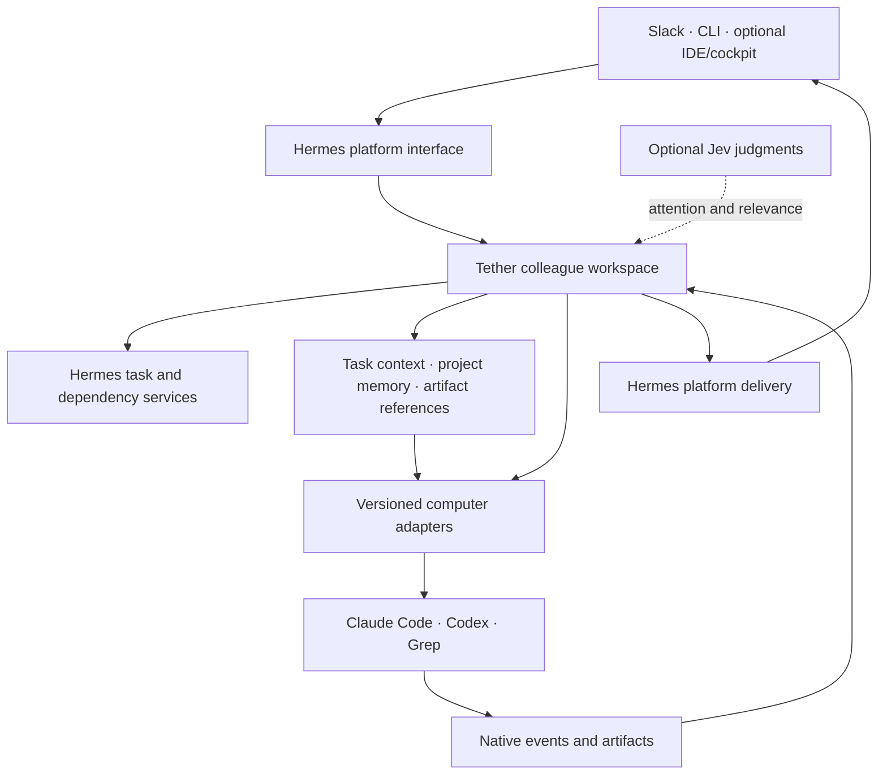

# Tether: an AI team workspace backed by real computers

Engineering and product roadmap — 4 October 2026.

**Give an AI colleague real work in Slack. It works in a real coding session, brings in useful teammates, shares the artifact, incorporates review and owns the outcome. You can follow up from Slack or return to the same computer.**

That is the product. Persistent sessions and reliable delivery make it possible. The ambition is a capable, compounding team: better context, tools, memory, collaboration and feedback should make the team more useful over time.

This roadmap supersedes the delivery-recovery milestone as the overall plan. That implementation remains a supporting execution change. No fleet rollout campaign or maintenance barrier is a prerequisite for the roadmap. Its priorities come from the [code, behavior and OSS audit](audit/2026-10-04-audit.md), not from a list of hypothetical platform features.

## The experience to build

A developer opens a Slack thread:

> Fix this bug in the attached repository. Have someone review it. Include tests and a short explanation.

The colleague sees the request, owns a task, chooses its configured computer and works in the correct repository. A reviewer receives the changed artifact and relevant context. A finding becomes a specific revision, not a fresh debate about the whole project. The owner delivers the result and verification. The developer later asks “also handle this edge case,” and the same working session continues.

At any point, “where are we?” has a useful answer: owner, completed work, current activity, dependency or review, next step and artifact. A promise to return is backed by an actual task and continuation. A desktop/terminal user can attach an already-running session; an empty fleet setup is not required.

For a new user, the project shows that story immediately through a replayable offline demo, then one honest setup path. Example colleagues are configurable; Parcha people and machines do not appear as everyone's default team.

## Target architecture

This is a proposed ownership structure, not a claim that all pictured integrations exist.

### One source of truth for each responsibility

| Responsibility | Authority | Tether relationship |
| --- | --- | --- |
| Colleague identity and configuration | Portable instance manifest | Role, profile, computer, projects, shared context and preferences. |
| Tasks, dependencies and durable continuation | Observed Hermes task/dependency services | Associate tasks with conversations and native work; request delegation/review and supported wakes. Goals describe the intended outcome in task context; a general released goal-service contract is unverified. |
| Native session and tool execution | Computer/runtime | Bind the exact session; submit one owned turn; expose actual capabilities and activity. |
| Conversation and execution association | Tether | Bindings, serialized attempts, task/session lineage, context preparation and collaboration. |
| Artifact | Producing repository/content and host publication | Stable version, producer/task reference and an accessible location; review the actual artifact. |
| Reusable memory | Existing scoped memory providers | Retrieve project/colleague/task context with provenance; preserve private scope. |
| Platform delivery | Hermes | Every final, root, explicit reply and file operation uses one supported host interface. |
| User-visible state | Projection of the above | Show task, computer and delivery status without substituting one for another. |

A task ID survives many attempts and messages. An attempt ID is one execution. A Slack thread is a conversation. A session is a computer context. A delivery receipt proves a platform outcome. These identities must remain distinct, with explicit relationships.

No new general agent framework, parallel task scheduler or all-purpose event bus is needed. Start with small typed interfaces and existing Hermes services. Inspect the actual public Hermes capability set when defining the supported host package; source observed on our local runtime is not automatically a released upstream contract.

### Computer contract

Publish a typed contract for discover/attach/start, validate identity, submit, observe, cancel and retrieve artifacts. Events identify the native session and execution and distinguish activity, result, error, permission/input request and confirmed interruption. Report supported capabilities rather than pretending every runtime can cancel, resume an external desktop session or expose tool events.

Claude Code should reuse Hermes's native implementation. Codex consolidation requires extending its reusable implementation with Tether's existing-thread/desktop-daemon semantics; simply importing a driver that only starts fresh threads would break the differentiator. Herdr is an optional interactive placement adapter. Grep becomes a computer through its actual execution API; its current Tether adapter does not yet exist.

Model and account selection remain explicit instance/computer configuration. Preserve the chosen default and explain a capability/auth problem clearly. Never conceal a session replacement or a different runtime behind a generic “recovery” message.

## Engineering workstreams

### 1. A compelling first run and public product

**Deliver:** a coherent installable project with neutral defaults, an offline demonstration and one useful real-session recipe.

- Reconcile current public main with the locally evolved colleague line. Port capabilities deliberately; settle existing mute, notices, launcher and prompt contracts; remove conflicting copies and obsolete guidance.
- Repair setup argument validation and help before mutation, documented unsupported flags, missing cockpit/schema promises and version/support inconsistencies. Make the current documented install resolve to an actual source or package artifact.
- Replace the bundled private roster with a small colleague/team manifest and generic collaboration contract. Derive runtime configuration, tool guidance and displayed roster from the same definitions.
- Ship proposed `tether demo`, task/status inspection and redacted effective-configuration help. The demo requires no Slack token or model call and is clearly simulated.
- Rewrite Start → Use → Troubleshoot → Extend → Internals. Show a short real workflow and the same-session advantage. Add a clean contribution recipe and a fake computer example.

**Observable outcome:** a stranger can understand the product, run the demo, connect a supported session and complete the documented recipe without private machine knowledge. Fix friction found in that journey instead of assuming infrastructure counts are adoption.

### 2. Tasks that remain owned until the work is finished

**Deliver:** a stable task/session relationship and a working implementer/reviewer loop.

- Reuse Hermes task claims, dependencies, completion and wake mechanisms. A task can be working, waiting on a reviewer, needing input or completed across multiple turns and sessions; the displayed labels project real task state.
- Carry the actual task reference into native context and tool calls. Replace the use of an attempt ID as the task identity.
- Add explicit operations for delegation, artifact publication, review request, findings, changed-work resubmission and completion. Keep natural conversation; structured actions record obligations and references.
- Route a dependency completion to the owner session and include the result it needs. Waiting has a real wake or named next action.
- Attach completion to the produced artifact and relevant verification. A sent promise does not close the task. Stop or redirect changes the owned task/execution state and the future continuation.

**Observable outcome:** an engineer fixes a sample-repository issue, a peer identifies a genuine problem, the engineer corrects it, and the thread receives the accepted artifact. Interrupting the conversation or asking for status does not erase the commitment.

### 3. Context and memory that compound

**Deliver:** a small, versioned context package for each continuation.

- Include the current goal, original request, latest human decisions, active task/dependency state, current artifact revision and unresolved review findings, with source references.
- Separate native session history from reusable project knowledge, colleague-private memory and task evidence. Expose the same scoped retrieval and task/artifact tools to supported computers.
- Retrieve relevant prior work through optional scoped memory providers and Recall skill/tool integration; a missing provider is visible. A common released host Recall API is not established by this audit. Save durable decisions/preferences with scope, not yesterday's status as permanent memory.
- Invalidate or refresh context when the human changes the brief or the artifact changes. Review the delta and affected assumptions, with access to the underlying evidence.
- Keep compaction and summaries inspectable; do not let an abbreviated thread replace a current request or a referenced attachment.

**Observable outcome:** a later follow-up reuses relevant work, a new reviewer sees the right artifact and decisions, and a correction changes subsequent behavior without the human re-explaining the whole project.

### 4. Collaboration with judgment

**Deliver:** useful attention, peer contribution and proactive continuation.

- Replace text-prefix guesses about housekeeping with authenticated typed notice categories. A substantive warning must remain available as work context.
- Keep resource budgets, but associate them with a task's time, model/tool cost and unresolved work; a consecutive-sender counter is not a definition of useful conversation.
- Allow colleagues to contribute evidence, alternatives and objections beyond a fixed lane when they improve the outcome. Avoid mandatory agreement rounds or acknowledgment loops.
- Use Jev as an optional judgment provider over explicit context: request/question, actionable correction, new information, acknowledgment, missing context, contributor/reviewer fit and relevance. Mixed acknowledgment-plus-work is allowed to carry both facts.
- Start with suggestions and prioritization; use reasoning or retrieve more context when the judgment is uncertain. Deterministic identity, ownership, permissions and cancellation remain code decisions. Do not use a single “ack” prediction to silently discard a work request.
- Compare policies on completed task episodes. Expand to deadline/dependency nudges and bounded autonomous work when they improve observed outcomes.

TypeSafe's current [State](https://docs.typesafe.ai/concepts/state) and [Noul](https://docs.typesafe.ai/primitives/noul) contracts support structured context and independent yes/no probabilities; they inform this proposed decomposition. This is not a measured Tether improvement. The existing shadow failures require a better problem definition and fresh evaluation, not a claim that adding a model makes routing intelligent.

**Observable outcome:** a useful correction reaches the owner, unnecessary acknowledgment stops, and a waiting task resumes when its dependency is ready. The team makes better decisions with fewer human reminders.

### 5. Runtime architecture and a developer extension kit

**Deliver:** clear host and computer interfaces that support the product without duplicating engines.

- Separate native protocol handling from scheduling, state persistence and final delivery. Extract orchestration and context/review services around the vertical workflow; avoid splitting modules solely to reduce line counts.
- Consolidate transport implementations with Hermes only after preserving external-session behavior. Publish a fake adapter and a contract suite so adding a computer does not require Slack credentials.
- Centralize host capability/version negotiation and platform operations; move direct Slack writes and regex adapter patches behind those interfaces.
- Derive CLI, broker/tool operation schemas, help and examples from shared contracts. Preserve the existing tokenless local boundary.
- Add a concrete Grep adapter after its API/capabilities are mapped. Expose artifacts and remote session activity through stable references rather than pretending a remote path is local.
- Offer a thin remote client for macOS/Windows before claiming native server parity. Let an IDE/cockpit consume the same status/events as Slack, without a second owner of the session.

**Observable outcome:** a contributor can implement and test a small adapter offline, and a user can move between Slack and the computer while continuing the same work.

### 6. A visible product and an improvement loop

**Deliver:** useful state, replayable failures and evidence that the team gets better.

- Present owner, task, computer, current activity, dependency/review, next action and artifact. Use quiet state changes and useful requested updates; show detailed traces in the developer view.
- Distinguish execution complete, task complete and result delivered. Unknown connection, interruption or receipt state is shown as unknown, not as a healthy Boolean.
- Replace first-reply metrics with outcome completion, correction incorporation, promised-work follow-through, stale-context mistakes, unnecessary turns, intervention rate and cost/time per accepted outcome.
- Include unanswered requests and unfinished work in the benchmark. Use independent tasks/threads, concrete artifact oracles and representative review/wait/correction episodes.
- Provide replayable fake events and redacted diagnostics; separately run actual model/computer episodes when measuring intelligence. Turn observed bugs into regression examples and compare changes on held-out tasks.
- Publish a concise demo, recipes, architecture and adapter guide. Observe unfamiliar users' setup/task friction and iterate. More channels, packaging formats or autonomous behaviors follow actual use rather than an invented adoption forecast.

**Observable outcome:** we can explain why a task stalled, reproduce it, fix it and show improvement in finished work. Users see a colleague that follows through, and contributors can improve it without access to our fleet.

## Build order

### First implementation, 5 October

Slice A has begun from public main `49d89245ede46d76f76aedcf1b9b7c8601896175`.
The first increment adds a neutral portable team manifest, shared Hermes/native
collaboration context, validated setup with explicit workspace activation, and
a core-driven offline artifact/review/correction/follow-up demo. Public setup,
architecture and contribution instructions are reconciled with that source.

The demo uses scripted fake computers and delivery; it does not establish a
real model's collaboration quality or a live Slack task service. The next
increment connects stable Hermes task references, artifact revisions, review
findings and dependency continuation to a real implementer/reviewer episode.
That remains part of slice A/B rather than being declared complete by a demo.

Work proceeds in visible slices; documentation, evaluation and architecture support each slice rather than forming a long prerequisite campaign.

| Slice | Ship | Work that can proceed together | Depends on |
| --- | --- | --- | --- |
| **A — A portable colleague** | Coherent public source/install, neutral manifest, safe help, offline demo, exact-session recipe | Public/local contract reconciliation; first task/context reference; outcome-episode harness | Existing session/broker infrastructure |
| **B — A team finishes work** | Stable task ownership, implementer/reviewer artifact loop, useful status, latest-decision context, real dependency wake | Host/platform facade and driver seam extraction driven by that workflow | SliceA's colleague/task identities |
| **C — The team gets smarter** | Scoped project memory, contextual attention, useful proactive continuation, measured Jev suggestions | Fresh held-out task episodes; context ranking; no-progress/resource policies | SliceB's observed task/artifact/context state |
| **D — An extensible ecosystem** | Grep computer, contributor adapter kit, remote clients, optional cockpit and additional recipes | Adapter examples/documentation can begin inA/B; runtime expansions follow actual capability contracts | Stable computer/event/status interfaces |

Nothing requires waiting for every runtime or every fleet instance. A single colleague is useful; the reviewer slice demonstrates collaboration; additional computers and richer autonomy build on concrete task outcomes.

## The first build tranche

The next implementation starts from current public main in an isolated worktree, using the development line as a source of reviewed capabilities rather than blindly replacing the tree.

| Work | Concrete landing area | Visible result |
| --- | --- | --- |
| Unify the product contract | `package.json`, `README.md`, `docs/ARCHITECTURE.md`, `docs/COMPATIBILITY.md`, active plugin and affected tests | One current supported product and reproducible contributor setup. |
| Portable colleagues | Replace hardcoded `runtime/plugin_next/team.md` defaults; add proposed manifest parsing and example configuration | A developer configures their own colleague and reviewer without editing package code. |
| Honest setup and runnable demo | `bin/tether.js`, `install.sh`, notifier argument parsing, examples and fake transports | Help never installs; an offline task/review/follow-up is immediately runnable. |
| Task/context/status vertical slice | Small task/context orchestration around `active.py`/`__init__.py`, existing Hermes tasks and broker/tool operations | A real task has an owner, an artifact, a review and an inspectable next step. |
| Outcome benchmark | Extend `evals/conversation`, fixtures and test entrypoints | The demonstration distinguishes a promise from finished work and includes corrections and unanswered requests. |

Implement the user journey while extracting the seams it needs. Keep source alignment and developer usability moving alongside task behavior. Saved-answer recovery belongs in the execution contract reconciliation; it is not the theme of the tranche.

## Definition of a product that shines

An outsider understands the value immediately, installs it without our private setup, gives a colleague a useful task, sees a teammate improve the result, gets an artifact they can use, and continues the same work later. The project is easy to inspect, extend and evaluate. That experience—not an agent count, a transport canary or a large list of future integrations—is the organizing outcome.
