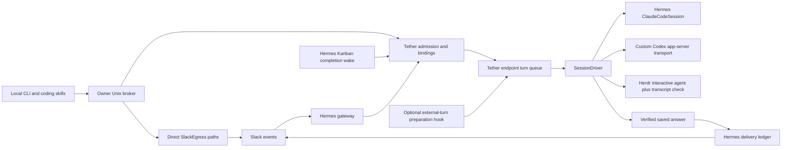

# Tether architecture audit — 2026-10-04

Tether already contains a valuable continuation engine: Slack can reach an exact native coding session, queued work shares one writer, and verified results can enter Hermes's durable delivery ledger. Making this a compelling colleague product requires a portable colleague and task model, a clearer host/runtime boundary, and a visible collaboration loop. More transport plumbing and incident-specific controls will not, by themselves, create that experience.

The recommended direction is **one colleague layer above Hermes services and native runtime adapters**. Hermes owns platform credentials, platform delivery, task services, memory providers, and reusable runtime implementations. Tether owns colleague configuration, external-session attachment, conversation-to-execution bindings, and coordination across those services. Native computers own their tool execution and transcript. This avoids building a second general agent framework while preserving Tether's strongest differentiator: continuing real work in the same computer.

## Scope and evidence

This is a read-only source audit of commit `60ef226d9d7c36514c9aa24ffcdd940d5ba8f9c1`, principally `runtime/plugin_next`. Paths below are relative to `tether/` unless absolute. Installed modules were compared by hash, and selected Hermes source was read from `/opt/greppy-hermes/runtime` and `/home/ubuntu/.hermes/hermes-agent`. The latter is a source checkout, not proof of the runtime used by every running gateway. No provider calls, live Slack actions, deployments, service changes, or tests were performed for this audit.

“Implemented” below means observed in these sources. It does not mean every installed profile has the capability. Proposed interfaces and product objects are recommendations, not existing features.

The ten plugin Python modules total **6,160 physical lines**. `ActiveSlice`'s module is 1,824 lines and `SessionDriver`'s is 1,321. `install.sh`, `bin/tether.js`, and the Python notification client add 3,430 lines. This is a measure of the surface a contributor must understand, not a complexity score or a justification for a numerical deletion target.

## What exists today

The diagram deliberately includes both outbound routes. Native final delivery uses a host ledger when the required plugin-context methods exist; notify, explicit reply, uploads, and other operations still have direct Slack paths.

| Responsibility | Source-observed owner and seam |
| --- | --- |
| Slack event admission | Hermes pre-dispatch hook calls Tether admission and `ActiveSlice.claim`; claimed events skip the ordinary Hermes agent (`runtime/plugin_next/__init__.py:334`). |
| Exact thread and native identity | Tether endpoints and binding generations in SQLite; endpoint identity includes source kind and native session ID (`active.py:329`, `store.py:21`). |
| Conversation scheduling | Tether persists turns, selects the oldest binding, and groups its ready messages into one accepted attempt (`store.py:547`). This is a turn queue, not a project-task graph. |
| Native execution | Hermes `ClaudeCodeSession` for headless Claude; custom Codex app-server handling; Herdr input/state with native transcript reconciliation (`session_driver.py:841`, `:923`, `:1070`, `:1090`). |
| Verified answer and receipt association | Driver and Store save answer provenance and prepare delivery; ActiveSlice delivers or reconciles it (`session_driver.py:1197`, `store.py:626`, `active.py:834`, `:1153`). |
| Platform delivery | Hermes plugin delivery facade for prepared results, but raw-token `SlackEgress` for several other operations (`__init__.py:745`, `slack_egress.py:28`). |
| Task completion wake | Hermes emits a process-owned native wake, then Tether admits it through its existing turn queue (`/opt/greppy-hermes/runtime/gateway/wake.py:53`, `__init__.py:334`, `active.py:650`). |
| Team behavior | Bundled `team.md`, prompt composition, trusted-peer admission, and a consecutive-peer limit (`__init__.py:203`, `active.py:374`, `:383`, `:576`). |
| Task and memory context | An optional Hermes lifecycle hook, with profile/cwd scoping; native execution is not shown to have a universal colleague-context contract (`__init__.py:665`). |

### Foundations worth preserving

1. **Real session continuity.** A thread targets a native session and workspace, rather than asking a fresh chat model to impersonate prior work. Claude already reuses Hermes's persistent stream-json implementation. This is the basis for a colleague who can pick up an unfinished branch, not merely discuss it.
2. **Durable endpoint serialization.** Binding identity, generation, queued turns, and accepted attempts give the system a concrete writer model. Many threads can share a computer without each independently writing to it (`store.py:539`, `:547`). This should survive refactoring.
3. **Results come from the native execution.** Driver completion and Herdr transcript matching are distinct from arbitrary model-authored Slack posts (`session_driver.py:619`, `:841`). Preserve that distinction in any new runtime adapter.
4. **A reusable host delivery service exists.** The Hermes facade checks platform readiness, prepares immutable obligations, and returns receipts (`/opt/greppy-hermes/runtime/hermes_cli/plugins_delivery.py:30`, `:41`, `:66`, `:81`). Tether can build on this instead of owning another platform outbox.
5. **Coordination can be grounded in actual tasks.** Authenticated Kanban completion wakes already cross into Tether. Hermes has task claims, dependencies, artifact attachments, and lifecycle hooks. Those are better building blocks than treating every peer message as a new task.
6. **Local integration is straightforward.** The owner-bound Unix broker allows coding clients to use Tether without acquiring their own Slack token (`broker.py:39`, `:158`). Keep this developer-friendly interface, with a documented protocol and typed operation results.

## High-impact architectural gaps

### 1. Runtime transport, execution state, and product policy are interleaved

`ActiveSlice` handles admission, scheduling, stop controls, execution preparation, saved-answer recovery, notices, Slack operations, process discovery, Herdr placement, and broker dispatch (`active.py:509` onward). `SessionDriver` both speaks runtime protocols and writes domain state, files, and delivery preparation (`session_driver.py:731`, `:1197`). Adding a new computer currently requires understanding most of this system.

There is also real duplication: Tether implements Codex WebSocket framing, stdio/daemon transport, JSON-RPC request dispatch, and an event pump (`session_driver.py:80`, `:185`, `:253`, `:376`). Hermes already has a Codex app-server client, event projection, and session class. However, the inspected Hermes session starts a new thread and does not expose Tether's exact existing-thread/desktop-daemon continuation contract (`/opt/greppy-hermes/runtime/agent/transports/codex_app_server_session.py:149`, `:181`). Replacing it with an import today would lose behavior.

**Change:** extract a small runtime contract and move transport mechanics to reusable Hermes adapters. Extend Hermes Codex with verified external-thread continuation and relevant cancellation/event parity before retiring Tether's implementation. Keep binding, attempt, saved-answer, and delivery orchestration outside runtime adapters. Herdr should implement the same interactive-runtime contract; it should not become the conceptual center of every colleague.

### 2. The host boundary is incomplete

The plugin feature-detects delivery methods, but imports Hermes internals for profile overrides, terminal scope, lifecycle hooks, session variables, and obligation identity (`__init__.py:670`, `:724`, `:745`). Missing external-turn preparation silently returns no context (`:677`). The inspected legacy `/opt` plugin declarations did not contain the newer `prepare_external_turn` declaration found in the modern Hermes source checkout. This is a compatibility gap to represent explicitly, not evidence that every live profile lacks memory.

Outbound authority is split. `op_notify` creates a pending binding, calls `_post`, then activates it (`active.py:1368–1380`). A crash after Slack accepts a root and before the timestamp is persisted leaves an ambiguous posting window; the pending binding alone does not prove exactly-once roots. `op_thread_reply` and `op_reply` also call `_post` directly (`:1658`, `:1687`). History, reactions, identity, and uploads use Tether's own token-backed Slack client. The native-final ledger does not cover all these operations.

Notice suppression also wraps the Slack adapter class through `sys.modules` and returns a successful send with no message ID for matching text (`notices.py:48`). This provides useful quietness but couples product policy to upstream message wording and class internals.

**Change:** negotiate named host capabilities at registration, such as prepared delivery, platform history, file publishing, semantic notices, external-turn context, task access, and scoped memory tools. Put all durable message-producing paths behind host operations. Treat reactions and other transient signals separately. Quietness should be a host display policy for typed notice categories, not regex interception. Unsupported capabilities should produce an explicit product fallback or unavailable feature. A published capability/API version is more useful to OSS contributors than exact source-SHA compatibility as the primary contract.

### 3. A session, a colleague, and a task are not yet distinct objects

The source has endpoints, bindings, turns, attempts, and saved answers. It does not expose a first-class colleague definition, stable mission/task identity, delegation, review assignment, or decision record. The external-turn hook even receives `task_id=attempt_id` (`__init__.py:702`): an execution attempt is not a stable task that can span many conversations and retries.

`team.md` contains a specific organization's colleagues and operating context. The same contract is registered after memory for Hermes sessions and appended inside composed native prompts (`__init__.py:203`, `active.py:374`, `:383`). This is effective local configuration, but packaging it as the default colleague model makes adoption depend on editing organization-specific prompts. The inspected runtime does not implement a Jev coordinator or a grep.ai runtime adapter; mentioning those computers or judgments in team instructions does not supply an integration.

**Change:** add a portable colleague manifest and task references. Separate `colleague_id`, host/profile ownership, `task_id`, `attempt_id`, and native execution/session identity. Use existing Hermes Kanban tasks and dependencies rather than introducing another project queue. Tether should attach task references to conversations and executions and offer native agents explicit task/artifact/review operations through the host's existing tool/MCP machinery.

### 4. Collaboration is primarily prompt behavior plus message heuristics

Peers can wake a bound session and task completions can do so durably. But the consecutive-peer cap in `claim` limits a pattern of messages, not a task's progress, novelty, review obligation, or attention budget (`active.py:576`). A useful discussion and a repeated empty acknowledgment can have the same routing shape.

**Change:** support a small collaboration vocabulary around existing tasks: delegate, publish artifact, request review, return findings, record decision, and complete or ask for input. A colleague can still contribute naturally in Slack; the structured actions should carry stable references and wake the right execution. This gives the product a visible work loop without enforcing a rigid consensus ceremony or requiring a new general event bus.

Jev can later provide typed judgments about relevance, urgency, reviewer fit, or whether a proposed contribution adds information. It should be optional and evaluated against actual task outcomes. Exact ownership, authorization, cancellation, and receipt state remain deterministic. There is no inspected source evidence that Jev currently performs this role.

### 5. State and health need clearer ownership and truthful projections

Tether's authoritative execution database, shadow journal, Hermes delivery ledger, task board, and native transcripts each have legitimate purposes. Their boundaries are currently connected through dictionaries, derived identities, file references, and reconciliation code. The goal should be explicit references and responsibilities, not copying all data into a single new database.

Current status names overstate their evidence. `slack_transport_connected` is derived from `auth.test`, not a Socket Mode connection check; `reply_poll_healthy` is always true; `queued_delivery_count` counts ready turns; Store reports zero uncertain/rebind counts regardless of unresolved execution data (`active.py:1301`, `store.py:1064`). `op_maintenance` is a no-op (`active.py:1337`). These are product trust problems, not cosmetic naming issues.

**Change:** project observed state into separate conversation, execution, task, and delivery views. Show owner, current task, active computer, last meaningful event, queued work, blocked reason, and delivered artifact. Unknown state should remain unknown. Native transcripts are execution evidence; scoped memory is reusable context; task state is an obligation; a delivery receipt is platform evidence. None should stand in for the others.

## One coherent target architecture

The repository currently preserves incompatible ambitions. `docs/ARCHITECTURE.md:19` assigns Slack writes and durable delivery to Tether. ADR-001 proposes a replacement continuation core and an authority-oriented target. `docs/upstream/hermes-claude-code-runtime.md:9` says native Hermes makes Tether's driver, store, broker posting, and Slack egress unnecessary for Slack-originated work. Today's plugin instead expands those responsibilities. Keeping all three as live architecture guidance leaves every contributor to choose a different destination.

Adopt the following public layering and supersede the contradictory architecture documents:

| Layer | Owns | Does not duplicate |
| --- | --- | --- |
| Hermes host | Platform ingress/egress and credentials; prepared delivery; task services; memory/tool services; profile ownership; reusable native runtime implementations. | A separate Tether Slack client or a second memory/task database. |
| Tether colleague product | Portable colleague definitions; conversation/task associations; delegation/review references; human-visible work state; external native-session attachment and its execution lineage. | General model reasoning, a second tools framework, or runtime-specific event pumps. |
| Runtime adapters | Start or attach to an exact computer, submit one owned turn, stream typed events, return terminal result and native identity, cancel, report capabilities. | Slack writes, colleague policy, task state, or delivery finalization. |
| Native computer | Tool execution, native transcript, permissions, workspace and compaction. | Platform routing or deciding that a Slack delivery receipt exists. |

A minimal driver contract needs start/attach, verify identity, submit/watch, cancel, and explicit capabilities: external resume, interactive placement, tool events, cancellation, and session portability across cwd. Do not force all computers to claim the same capabilities. Implement adapters around existing runtime APIs; the exact grep.ai interface still needs investigation before defining its support level.

Prefer Hermes's native runtime path for a new Slack-born colleague session. Preserve Tether's binding/execution core for externally started sessions and cross-conversation work. The user should see one colleague experience, while there is only one actual owner of a given native turn. Moving responsibilities should follow this ownership rule rather than deleting the external continuation machinery wholesale.

A colleague manifest should describe identity, role, profile, default computer, workspace, and project/team context without embedding local people or machine names in code. A task reference should point to the existing task service. An artifact reference should carry its location, content identity where appropriate, producing task/execution, and review findings or decision. Introduce only the fields needed by the first real workflow; do not build an abstract ontology in advance.

Memory should remain scoped: private colleague context, explicit project/team context, and task-local evidence. Use Hermes's existing memory providers and native tool bridge, and expose retrieval provenance. Sharing useful project knowledge must not silently merge independent profiles' private memory. A long-lived task needs task-linked context in addition to the latest Slack messages; that context is distinct from a full transcript dump.

## Sequenced workstreams

### 1. Publish one honest, portable product surface

Unify the public and locally maintained implementation into one contributor-visible source of truth. Replace obsolete architecture links and align README, compatibility, configuration, CLI examples, and plugin docstrings with that source. Supersede the competing ADR/runtime target documents with the ownership decision above, preserving them as clearly labeled history. Replace the packaged organization roster with a generic colleague example and optional local team configuration. Document what the host must supply through capability negotiation and what Tether can do when a capability is absent.

Ship a concrete first-run example: one engineering colleague and one reviewer in a Slack workspace, working on an ordinary repository. Show how to start a task, inspect who owns it, review an artifact, and continue the same computer. This should be a product deliverable, not another fleet-installation report.

### 2. Build the engineer/reviewer task loop using current foundations

Implement the narrow vertical slice: Slack request → stable task → assigned colleague → native work → artifact → peer review → findings or revision → visible result. Reuse the existing Kanban task service and native completion wake. Add task references to turn context instead of substituting attempt IDs. Present useful progress and blocked reasons in the thread without generic processing spam.

This work can start before every transport is refactored. It provides a real consumer for the host and driver contracts and prevents a long platform rewrite from postponing the colleague experience.

### 3. Consolidate runtime and platform seams around that consumer

Extract execution persistence/finalization from transport handling. Complete the reusable Hermes Codex external-resume contract and replace duplicated protocol code when it has the required semantics. Keep Herdr as an optional placement adapter. Move root posts, explicit replies, and file publishing through host platform operations; provide semantic notice controls and actual connection/queue projections. Publish versioned host and driver interfaces with examples for a third computer.

Delete obsolete paths and helpers as responsibilities move. Do not replace two large modules with dozens of modules that still share the same mutable dictionaries and callback assumptions.

### 4. Make context and collaboration compound

Expose task, artifact, and scoped-memory tools uniformly to native computers. Keep a task-linked context summary with references to source evidence and decisions. Support explicit delegation and review requests across colleagues and computers, using existing task dependencies and completion wakes. Add bounded attention and work budgets around tasks, rather than relying only on a consecutive-peer counter.

### 5. Add selective intelligence and broaden runtime support

Use real collaboration examples to assess whether typed Jev judgments improve routing, review selection, or contribution quality. Keep them optional and inspectable. Investigate grep.ai's concrete computer interface and implement only capabilities its API actually supports. Evaluate colleague quality through completed work, useful review findings, continuity, and time to resolve a blocked task; transport correctness remains necessary infrastructure, not the whole scorecard.

The compelling outcome is easy to explain: an outsider installs a generic colleague, gives it real work in Slack, sees it collaborate with a reviewer, receives a useful artifact, and can resume its unfinished work in the same computer. That is the north star for the workstreams above.

## Public documentation and installed-source divergence

The checked-in public surface is materially stale:

- `README.md:1` and `docs/ARCHITECTURE.md:3` describe `0.3.0-beta.1`, schema 17, and old endpoint machinery. `package.json` and `runtime/plugin_next/plugin.yaml` are `0.4.0`; the current status response reports schema 18.
- `docs/ARCHITECTURE.md:5` links implementation files that no longer exist in this tree: `runtime/bridge_runtime.py`, `runtime/plugin/__init__.py`, and `runtime/routing.py`.
- `docs/COMPATIBILITY.md:1` describes an older exact Hermes/Herdr compatibility baseline. It does not explain current host delivery/context capabilities or their fallback behavior.
- `runtime/plugin_next/__init__.py:1` still describes a shadow-only plugin even though it registers active admission, execution, broker operations, and tools.
- `config.example.toml` retains fields belonging to older architecture; it is not a reliable specification of the current `ActiveSettings` interface (`active.py:249`, `:287`).

These observations concern the repository's public-facing source. No package-registry query was performed, so this audit does not claim the contents of the currently published npm artifact.

### Latest public main is a third implementation baseline

The authenticated fetched public main is `b7b9d0ff8542b289a8389a8d01d9f5ba65705af0`, dated 2026-10-03. It is not equivalent to either this audit checkout or the installed primary. Comparing that commit with `60ef226` changes 28 tracked Tether files, with 6,385 additions and 953 deletions; the nine changed `plugin_next` assets alone account for 2,171 additions and 533 deletions. These are raw git diff counts, including tests and documentation in the larger total.

Specific architectural differences, verified using `git show` of that public commit:

| Area | Public main `b7b9d0f` | Audit source `60ef226` |
| --- | --- | --- |
| Claude transport | Own `SessionProcess`, send/read-result path, and process pump (`session_driver.py:42`, `:637`). | Reuses Hermes `ClaudeCodeSession` with native turn result and correlation (`session_driver.py:1070`). |
| Native identity mismatch | Logs a warning when a Claude result answers as another session (`session_driver.py:656`). | Exact native identity and ownership checks participate in result handling. |
| Delivery state | No `delivery_ref` or `saved_answers` table in the inspected public Store. Direct final/failure egress is part of the existing driver/slice. | Host prepared-delivery integration, pinned answer provenance, and saved-answer reconciliation (`__init__.py:745`, `store.py:626`, `active.py:834`). |
| Team contract | Packaged organization-specific team layer v6 (`team.md:1`). | Organization-specific layer v13; installed primary has another team hash. |
| Public description | Same shadow-only plugin docstring and older public architecture guidance. | Same stale description despite substantial additional active behavior. |

This divergence is a broad engineering priority. An outside contributor cannot reproduce the locally observed product from public main, and a maintainer must distinguish public, installed, and development semantics before changing it. Resolve that by making one public code line authoritative, keeping organization configuration outside the package, and contributing host capabilities upstream or as a clearly versioned compatibility extension. The goal is to eliminate private system knowledge and duplicated implementation tracks, not to add a new release gate.

The local primary installation also differs from this audit checkout. Seven of twelve packaged source assets match; five differ. In particular, source-observed saved-answer recovery must not be described as an installed fleet feature based on this checkout alone.

| Asset | Audit SHA-256 | Installed primary SHA-256 |
| --- | --- | --- |
| `__init__.py` | `dfde41785257daede6531a470a98359f79df25977db0d911b40ecf0e801a43fa` | `454d3704f35f3704003f7d6635a397999f0b644534ad9b955350e0a76c6934de` |
| `active.py` | `d5c5670302c8b2fddeb2782c8476dc425b97f228e34680a5d5e1acc8867ad8be` | `1c071b4cee8d69205638b3341915a8be572923ac31adbe1518d6974afb48a9d3` |
| `session_driver.py` | `8b9111e577647b1d3de5aee3af419e5cbbcbb21b1ab31c5af233032c7cc26d63` | `9c54de016dd443d04c7af9af154bd1841c5c2d7876ca1b81f067f2d87aa399a9` |
| `store.py` | `ba2dd95bb2267fd23b7e74452af1de7137b8566fbe540ae159698c8ffbb9a772` | `2bc5fb32d31d997385ba6cb0cf1304709f0abf4735d48ec3051e15df138dfcf6` |
| `team.md` | `73a402dd38cb343b1cbf14080413954107472ece48f7db1d908e93f48c14ebe1` | `83c5f6df7f3d5ab917235eeaa73c98c820de61e038055183836bf4e57f74699a` |

Installed comparison root: `/home/ubuntu/.hermes/plugins/tether`. This table establishes local source divergence, not current fleet health or feature acceptance.
